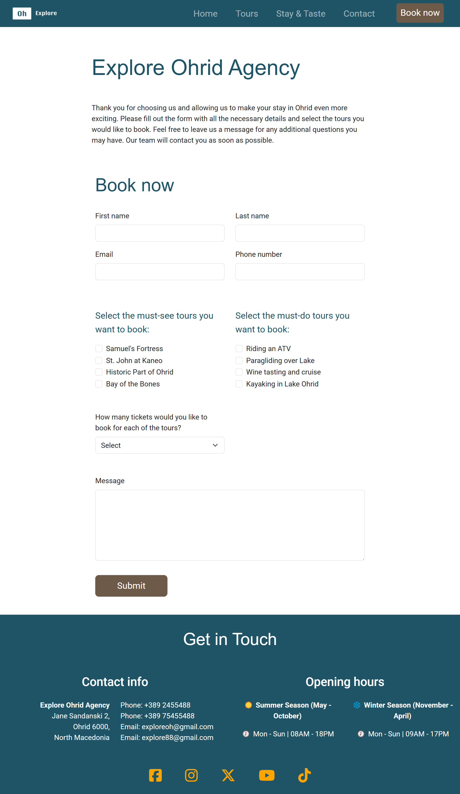
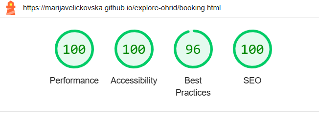
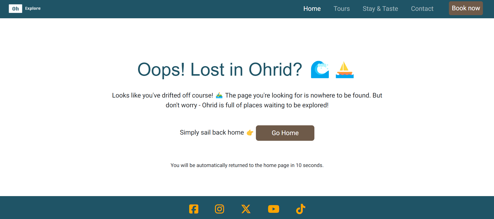

# Testing

> Return back to the [README.md](README.md) file.

## Code Validation

### HTML

I have used the recommended [HTML W3C Validator](https://validator.w3.org) to validate all of my HTML files.

| Directory | File | URL | Screenshot | Notes |
| --- | --- | --- | --- | --- |
|  | [404.html](https://github.com/marijavelickovska/explore-ohrid/blob/main/404.html) | [HTML Validator](https://validator.w3.org/nu/?doc=https://marijavelickovska.github.io/explore-ohrid/404.html) |  | Notes (if applicable) |
|  | [booking.html](https://github.com/marijavelickovska/explore-ohrid/blob/main/booking.html) | [HTML Validator](https://validator.w3.org/nu/?doc=https://marijavelickovska.github.io/explore-ohrid/booking.html) |  | Notes (if applicable) |
|  | [index.html](https://github.com/marijavelickovska/explore-ohrid/blob/main/index.html) | [HTML Validator](https://validator.w3.org/nu/?doc=https://marijavelickovska.github.io/explore-ohrid/index.html) |  | Notes (if applicable) |
|  | [stay-taste.html](https://github.com/marijavelickovska/explore-ohrid/blob/main/stay-taste.html) | [HTML Validator](https://validator.w3.org/nu/?doc=https://marijavelickovska.github.io/explore-ohrid/stay-taste.html) |  | Notes (if applicable) |
|  | [success.html](https://github.com/marijavelickovska/explore-ohrid/blob/main/success.html) | [HTML Validator](https://validator.w3.org/nu/?doc=https://marijavelickovska.github.io/explore-ohrid/success.html) |  | Notes (if applicable) |
|  | [tours.html](https://github.com/marijavelickovska/explore-ohrid/blob/main/tours.html) | [HTML Validator](https://validator.w3.org/nu/?doc=https://marijavelickovska.github.io/explore-ohrid/tours.html) |  | Notes (if applicable) |

### CSS

I have used the recommended [CSS Jigsaw Validator](https://jigsaw.w3.org/css-validator) to validate all of my CSS files.

| Directory | File | URL | Screenshot | Notes |
| --- | --- | --- | --- | --- |
| assets | [style.css](https://github.com/marijavelickovska/explore-ohrid/blob/main/assets/css/style.css) | [CSS Validator](https://jigsaw.w3.org/css-validator/validator?uri=https://marijavelickovska.github.io/explore-ohrid) |  | Notes (if applicable) |

## Responsiveness

I've tested my deployed project to check for responsiveness issues.

| Page | Mobile | Tablet | Desktop | Notes |
| --- | --- | --- | --- | --- |
| Home |  |  |  | Works as expected |
| Tours |  |  |  | Works as expected |
| Stay and Taste |  |  |  | Works as expected |
| Booking |  |  |  | Works as expected |
| Confirmation |  |  |  | Works as expected |
| 404 |  |  |  | Works as expected |

## Browser Compatibility

I've tested my deployed project on multiple browsers to check for compatibility issues.

| Page | Chrome | Firefox | Edge | Notes |
| --- | --- | --- | --- | --- |
| Home |  |  |  | Works as expected |
| Tours |  |  |  | Works as expected |
| Stay and Taste |  |  |  | Works as expected |
| Booking |  |  |  | Works as expected |
| Confirmation |  |  |  | Works as expected |
| 404 |  |  |  | Works as expected |

## Lighthouse Audit

I've tested my deployed project using the Lighthouse Audit tool to check for any major issues. Some warnings are outside of my control, and mobile results tend to be lower than desktop.

| Page | Mobile | Desktop |
| --- | --- | --- |
| Home |  |  |
| Tours |  |  |
| Stay and taste |  |  |
| Booking |  |  |
| Confirmation |  |  |
| 404 |  |  |

## Defensive Programming

Defensive programming was manually tested with the below user acceptance testing:

| Page | Expectation | Test | Result | Screenshot |
| --- | --- |  --- |  --- |  --- |
 | Home | Feature is expected to display content and images to attract users to book a tour. | Verified that the page displays the agency's purpose in a clear and concise manner. | The purpose were displayed as expected. | |
| Navbar | Feature is expected to have accessible navigation links. | Checked navigation links for correct functionality and accessibility. | Navigation links were functional and accessible. |  |
| | Feature is expected to be fully responsive. | Resized the browser window and tested on multiple devices (mobile, tablet, desktop). | The page was responsive across all tested screen sizes. |  |
| Explore Ohrid | Feature is expected to show the user attractions that Ohrid has to offer. | Confirmed that the page contains a structured text explaining the attractions, as well as a carousel with images for visually displaying them. | Text and images was displayed as expected and the button "See Our Tours" redirect the user to the tours page. |  |
| Testimonials | Feature is expected to display testimonials from people who have visited the tours. | Verified that the page shows all testimonials. | Testimonials were displayed as expected. |  |
| Contact | Feature is expected to display all contact information for the agency, as well as its opening hours. | Verified that the contact contains all the necessary information, such as address, phone, email, and opening hours. | Contact information is displayed as expected, visible and easily accessible. |  |
| Social Links | Feature is expected to include working links to the explore Ohrid agency's social platforms (Instagram, Facebook, etc.). | Clicked each social link to verify redirection to the correct platform page. | All links redirected to the correct platform pages, opening in new browser tabs. |  |
| Tours | Feature is expected to display all the tours offered by the agency with all the details for each of them. | Confirmed that all tours are displayed correctly as must-see and must-do tours. For each tour, an image and details about the date and price are shown. Also, a link leading to the 'book now' form is provided. | Tours are displayed as expected, the link redirect to the booking page.|  |
| Accomodations and restaurants | Feature is intended to offer recommendations for hotels and restaurants. | Confirmed that the page contains a separate section for accommodation offers and a separate section for restaurant offers, as well as links to see more for each recommendation. | Accomodations and restaurants are displayed as expected. The links opens in a new tab. |  |
| Book-now Form | Feature is expected to prevent submission of an empty form. | Attempted to submit the form without filling any fields. | Form submission was blocked, as expected. |  |
| Confirmation | Feature is intended to confirm to the user that they have successfully submitted the form. | Confirmed that after filling out all the inputs in the form and successfully submitting the form, a confirmation appears informing the user that the form has been successfully submitted. | Confirmation is displayed as expected. |  |
| 404 Error Page | Feature is expected to display a 404 error page for non-existent pages. | Navigated to an invalid URL (e.g., `/test`) to test error handling. | A custom 404 error page was displayed as expected. |  |

## User Story Testing

| Target | Expectation | Outcome | Screenshot | 
| --- | --- | --- | --- | 
| As a user  | I want to read and see some information about the city                                         | so that I can be better informed about what it offers before visiting.       |  |
| As a user  |  I want to see photos of the tours                                   | so I can visually compare them, choose the most appealing one, and select the best option for me.               |  |
| As a user  | I want each tour to display details about the schedule and price                | so that I can choose the one that best fits my budget and preferences.              |  |
| As an user | I want to read experiences and reviews from others                  | so that I can be sure I want to explore Ohrid through this agency.                 |  |
| As a user  | I want to see recommendations for accommodation                       | as I feel more relaxed when I can organize my entire trip in one place.               |  |
| As a user  | I want to see recommendations for  restaurants                      | as I feel more relaxed when I can organize my entire trip in one place.               |  |
| As a user  | I want to have the option to book tours through the website | so that I can secure my spot in advance.                                |  |
| As a user  | I want to see a confirmation message after submitting the form | so I can be sure that the tour has been reserved.   |  |
| As a user  | I would like the website to be fully responsive                        | so that I can easily navigate and access information from my phone, tablet, or desktop. |  |
| As a user  | I would like to see a 404 error page if I get lost                              | so that it's obvious that I've stumbled upon a page that doesn't exist.                 |  |

## Bugs

### Fixed Bugs

I've used [GitHub Issues](https://www.github.com/marijavelickovska/explore-ohrid/issues) to track and manage bugs and issues during the development stages of my project.

All previously closed/fixed bugs can be tracked [here](https://www.github.com/marijavelickovska/explore-ohrid/issues?q=is%3Aissue+is%3Aclosed+label%3Abug).

### Unfixed Bugs

Any remaining open issues can be tracked [here](https://www.github.com/marijavelickovska/explore-ohrid/issues).

### Known Issues

| Issue | 
| --- |
| The form works correctly with all fields except the checkbox. I am aware that it can be submitted without checking any box, but solution would be to use JavaScript, so I left it for now as it is. | 

> There are no others remaining bugs that I am aware of, though, even after thorough testing, I cannot rule out the possibility.

### Other Findings

> I know that some of my commits are quite long, but I’m aware of that and believe that throughout this entire process, I've learned a lot - including how to improve my commits.

